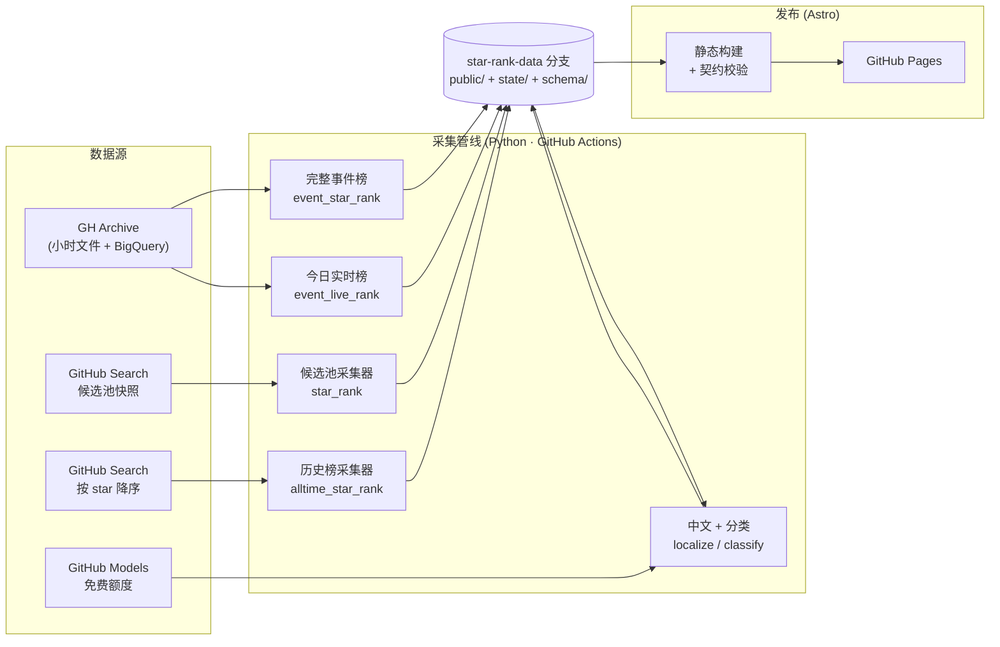
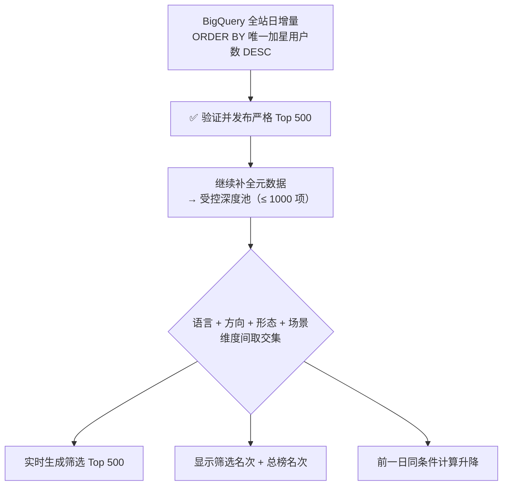

<div align="center">

# ⭐ 开源星榜 · Open Source Star Rank

**每天自动更新的 GitHub 开源趋势站：公开事件新增 Star Top 500、候选池净增、7/30 日趋势与历史 Top 1000**

[](https://github.com/728792899-create/open-source-star-rank/actions/workflows/star-rank-pages.yml)
[](https://github.com/728792899-create/open-source-star-rank/actions/workflows/star-rank-events.yml)
[](https://github.com/728792899-create/open-source-star-rank/actions/workflows/star-rank-events-live.yml)
[](https://github.com/728792899-create/open-source-star-rank/actions/workflows/star-rank-localization.yml)
[](https://github.com/728792899-create/open-source-star-rank/actions/workflows/star-rank-alltime.yml)
[](https://github.com/728792899-create/open-source-star-rank/actions/workflows/star-rank-ci.yml)
[](LICENSE)

[🌐 正式站点](https://728792899-create.github.io/open-source-star-rank/) ·
[🧭 组合筛选榜](https://728792899-create.github.io/open-source-star-rank/) ·
[🏆 历史 Top 1000](https://728792899-create.github.io/open-source-star-rank/all-time/) ·
[📊 采样状态](https://728792899-create.github.io/open-source-star-rank/status/) ·
[📐 数据口径](https://728792899-create.github.io/open-source-star-rank/methodology/) ·
[📦 开放 JSON](https://728792899-create.github.io/open-source-star-rank/data/events/index.json) ·
[💻 GitHub 源码](https://github.com/728792899-create/open-source-star-rank) ·
[♻️ 复用声明](REUSE.md)

</div>

---

## 这是什么

**开源星榜**是一个每天自动运行、完全由 GitHub Actions 驱动的中文开源项目趋势站。它把 GH Archive 公开事件、GitHub API 快照和可复现的数据契约组合成静态榜单，不做网页爬虫、不猜测、不补零，只发布可以被独立验证的信号；榜单页面、历史记录和 JSON 数据均可公开访问和复用。

- ⚡ **今日实时新增榜** —— 每小时累计 [GH Archive](https://www.gharchive.org/) 已完整归档的今日公开 WatchEvent，排名会随当日数据变动。
- 📈 **昨日完整新增榜** —— 只在 24/24 小时全部通过校验后发布，作为可固定访问的历史日榜。
- 🔁 **候选池净增榜** —— 用北京时间连续快照追踪一个候选池，计算真实发生的 Star 净增（日 / 7 日 / 30 日）。
- 🧭 **组合筛选结果** —— 在当前榜单页面选择语言、项目方向、产品形态和适用场景，直接从受控深度池中重排最多 500 项，并保留总榜名次。
- 🏆 **全站历史星标 Top 1000** —— 累计 Star 最高的 1000 个开源项目「名人堂」。
- 🀄 **中文项目内容** —— 由 GitHub Models 生成的中文功能名与简介，原文一键切换。
- 🔎 **项目介绍页** —— 汇总项目用途、适合人群、上榜原因、分类、真实历史和相似项目，再由用户决定是否前往 GitHub。
- ⭐ **本地项目工作区** —— 无需登录即可收藏、最近查看和对比最多 4 个项目；记录只保存在当前浏览器。

> ⚠️ **关于「全站」二字**：事件榜的「全站」严格指 **GH Archive 实际归档的 GitHub 公开事件范围**，不是 GitHub 官方内部统计，也不扣除取消 Star。这是一张诚实的**观测榜**，而非官方净增榜。

---

## 榜单一览

| 榜单 | 口径 | 排序指标 | 深度 | 更新频率 | 页面 |
| :-- | :-- | :-- | :-: | :-- | :-- |
| 今日实时新增榜 | GH Archive 小时归档 | 截止时间内唯一加星用户数 | 最多 Top 500（5 页） | 01:45–23:45 每小时 | [`/`](https://728792899-create.github.io/open-source-star-rank/) |
| 昨日完整新增榜 | GH Archive 24/24 小时 | 北京时间自然日唯一加星用户数 | Top 500（5 页） | 每日 07:30 | [`/events/yesterday/`](https://728792899-create.github.io/open-source-star-rank/events/yesterday/) |
| 候选池净增榜 | 连续快照候选池 | 当日 Star 净增 | 最多 Top 500 | 每日 00:20 | [`/daily/`](https://728792899-create.github.io/open-source-star-rank/daily/) |
| 7 日 / 30 日榜 | 连续快照候选池 | 周期 Star 净增 | 最多 Top 500 | 每日 | [`/period/7d/`](https://728792899-create.github.io/open-source-star-rank/period/7d/) |
| 语言净增榜 | 连续快照候选池 | 当日 Star 净增 | 最多 Top 500 | 每日 | [`/language/`](https://728792899-create.github.io/open-source-star-rank/language/) |
| **组合筛选结果** ✨ | 各榜受控深度池 | 沿当前榜口径筛选重排 | 最多 500 项 | 随榜更新 | 各榜单页内直接筛选 |
| **历史星标榜** ✨ | GitHub 搜索累计 Star | 累计 Star 总数 | **Top 1000** | 每周一 10:00 | [`/all-time/`](https://728792899-create.github.io/open-source-star-rank/all-time/) |

✨ = 本次新增能力。所有榜单都可随时切换回全站总榜，都保留「中文 / 原文」切换与 JSON 下载。

---

## 系统架构

四条相互独立的数据管线各自采集、校验、发布到机器数据分支 `star-rank-data`，Astro 在构建时把它们组合成静态站点，最终部署到 GitHub Pages。任何一条管线失败都不会污染其它管线。



---

## 亮点一：榜单内组合筛选与实时重排

过去筛选只隐藏当前页面中不匹配的项目。现在用户可在任意榜单页组合选择语言、方向、形态和场景；系统从该榜的受控深度池中重新排序并最多返回 500 项，使用 `result_page` 每页展示 100 项，不足时展示全部匹配结果。

事件榜使用最多 1000 项扩展池；候选池日榜和 7/30 日榜使用全部可比较候选（最多 2000 项）；历史累计榜使用 Top 1000。深度池永久保留，历史日期也能恢复相同筛选条件并计算筛选榜名次变化。



- 事件榜前 500 项是**严格门槛**：在 900 个候选和 950 次 API 请求预算内不足 500 个有效公开仓库时，整次发布失败并保留旧榜；500–1,000 项扩展筛选池才是尽力而为。
- 分类由 GitHub Models 从**版本化固定词表**中选择：一个主方向、一个产品形态、1–4 个适用场景。
- 固定词表规模：**13 个项目方向 · 8 种产品形态 · 31 个适用场景**（见 [`data/classification-taxonomy.zh-CN.json`](data/classification-taxonomy.zh-CN.json)）。

## 亮点二：全站历史星标 Top 1000

一张跨越时间的「名人堂」，回答「哪些开源项目积累了最多 Star」，与每日新增榜互补。

- 通过 GitHub 搜索按累计 Star **降序**采集前 1000 个公开仓库，剔除 fork、已归档、已禁用与私有项目。
- GitHub 单次搜索最多返回 1000 条结果，恰好等于发布深度 —— 因此这是搜索口径下**真实的全站累计前 1000**。
- 每周一北京时间 10:00 自动更新（约 10 次 API 请求，成本极低）；失败时保留上一版并显示更新时间。
- 页面支持与其它榜单一致的语言 / 方向 / 形态 / 场景筛选与关键词搜索。

---

## 数据口径与边界

严格的契约是这个项目的核心。**不诚实的数字不如没有数字。**

- **唯一加星定义**：全站公开事件新增 = 北京时间自然日内唯一 `(repository_id, actor_id)` 数量；同一用户对同一仓库每天最多计一次。
- **不是官方净增**：GH Archive 是第三方公共事件归档；事件榜扫描其归档的全部公开事件，但不包含私有活动、无法证明官方内部事件无遗漏，也不扣除取消 Star。
- **完整性证明**：实时榜仅累计已完整归档的小时；昨日完整榜必须证明统计窗口 **24/24 小时**均有源事件，并在全局排序后获得完整 500 个有效公开仓库。
- **费用护栏**：事件查询先 dry-run，单次最多扫描 **24 GiB**；生产要求使用**未绑定结算账号**的 BigQuery Sandbox 项目。
- **快照纪律**：有效快照必须在北京时间 `00:00–03:00` 采集，相邻日期连续且间隔 21–27 小时；候选池最多 **2,000** 个公开仓库。
- **不造数据**：缺失日期不补采、不补零、不插值。
- **数据留存**：机器数据在独立的 `star-rank-data` 分支；公开日榜永久保留，完整候选快照保留 90 日，扩展分类池保留 14 日，全量事件聚合仅在数据分支保留 30 日。
- **中文与分类**：由 GitHub Models 生成并按 repository ID 缓存，**只使用 Actions 自带令牌与免费额度**；模型不可用时回退 GitHub 原文或「分类待生成」，不阻塞榜单。人工修订见 [`data/localization-overrides.zh-CN.json`](data/localization-overrides.zh-CN.json) 与 [`data/classification-overrides.zh-CN.json`](data/classification-overrides.zh-CN.json)。
- **隐私**：本仓库不包含、依赖或链接任何私有内容；固定种子仅保存公开 GitHub 仓库名。收藏、对比和最近查看记录只保存在用户浏览器的 `localStorage`，不会上传。

---

## 公开数据接口

所有榜单都以静态 JSON 发布，并附带版本化的 [JSON Schema](https://728792899-create.github.io/open-source-star-rank/data/schema/index.schema.json) 契约。

| 数据 | 接口 |
| :-- | :-- |
| 候选池索引 | [`/data/index.json`](https://728792899-create.github.io/open-source-star-rank/data/index.json) |
| 全站公开事件 | [`/data/events/index.json`](https://728792899-create.github.io/open-source-star-rank/data/events/index.json) |
| 今日实时榜 | [`/data/events/live.json`](https://728792899-create.github.io/open-source-star-rank/data/events/live.json) |
| 事件榜筛选深池（永久） | `/data/events/category/YYYY-MM-DD.json` |
| 候选/周期筛选深池（永久） | `/data/explore/daily/YYYY-MM-DD.json` · `/data/explore/period/{7d\|30d}/YYYY-MM-DD.json` |
| 全站历史星标 | [`/data/alltime/top-1000.json`](https://728792899-create.github.io/open-source-star-rank/data/alltime/top-1000.json) |
| 中文项目内容 | [`/data/i18n/zh-CN/repositories.json`](https://728792899-create.github.io/open-source-star-rank/data/i18n/zh-CN/repositories.json) |
| 项目分类 | [`/data/classification/index.json`](https://728792899-create.github.io/open-source-star-rank/data/classification/index.json) |
| 订阅 | [RSS](https://728792899-create.github.io/open-source-star-rank/rss.xml) · [Atom](https://728792899-create.github.io/open-source-star-rank/atom.xml) · [JSON Feed](https://728792899-create.github.io/open-source-star-rank/feed.json) |

---

## 复用与许可

- 仓库源代码、工作流、Schema 和项目原创文档采用 [MIT License](LICENSE)，允许修改、部署、分发和商业使用，但须保留版权与许可文本。
- 在本项目拥有相关权利的范围内，公开生成的排行 JSON、派生统计和原创可视化按 [CC BY 4.0](https://creativecommons.org/licenses/by/4.0/) 复用；请注明“开源星榜”、数据日期、榜单口径并链接本站。
- GitHub 和 GH Archive 的原始数据、各仓库内容及商标仍归相应权利人；复用结果不得描述为 GitHub 官方统计，也不得暗示原项目作者或本站为衍生产品背书。
- Fork 部署、数据转载和二次排名的完整要求见 [《开源星榜复用声明》](REUSE.md)。

---

## 仓库结构

```text
open-source-star-rank/
├── tools/                      # Python 采集与校验管线
│   ├── event_star_rank.py      #   全站公开事件榜 + 扩展分类池
│   ├── event_live_rank.py      #   今日小时级实时新增榜
│   ├── star_rank.py            #   候选池快照采集与净增榜
│   ├── alltime_star_rank.py    #   ✨ 全站历史星标 Top 1000 采集
│   ├── localize_repositories.py#   GitHub Models 中文内容
│   ├── classify_repositories.py#   固定词表分类
│   └── validate_star_rank_data.py  # 数据契约校验
├── schemas/star-rank/          # 所有公开数据的 JSON Schema
├── data/                       # 固定词表、人工修订、种子仓库
├── site/                       # Astro 静态站点
│   ├── src/pages/              #   榜单、项目介绍与本地对比页面
│   ├── src/lib/facet-rankings.ts   # ✨ 分类独立榜生成逻辑
│   └── scripts/                #   数据准备、构建校验、E2E 夹具
├── tests/                      # Python 单元测试
└── .github/workflows/          # 8 个采集、发布、看门狗与校验工作流
```

---

## 本地开发

```bash
# 1. Python 采集与校验
python3 -m pip install -r requirements-star-rank.txt
python3 -m unittest discover -s tests -v

# 2. 站点（默认展示「等待首个基线」的真实初始化态）
cd site
npm ci
npm test            # 过滤逻辑单元测试
npm run check       # Astro 类型检查
npm run build       # 静态构建
npm run validate-build   # 校验产物契约

# 3. 用完整测试夹具预览真实榜单
node scripts/create-e2e-data.mjs
STAR_RANK_DATA_DIR="$PWD/.e2e-data" npm run build && npm run validate-build
```

测试夹具由 `scripts/create-e2e-data.mjs` 在临时目录生成，包含 40 个候选日期、7 个事件日期、**300 项扩展分类池**、**200 项历史星标榜**、2000 个项目页与中文 / 分类，不会进入生产数据。

---

## 更多文档

- 📘 完整采集、恢复与故障处理流程 → [运行手册 `docs/STAR_RANK_RUNBOOK.md`](docs/STAR_RANK_RUNBOOK.md)
- 🎨 站点实现说明 → [`site/README.md`](site/README.md)
- 📐 在线数据口径页 → [methodology](https://728792899-create.github.io/open-source-star-rank/methodology/)

<div align="center">

**数据来自 GH Archive 与 GitHub 公共 API · 实时榜每小时更新 · 完全零费用运行**

</div>
