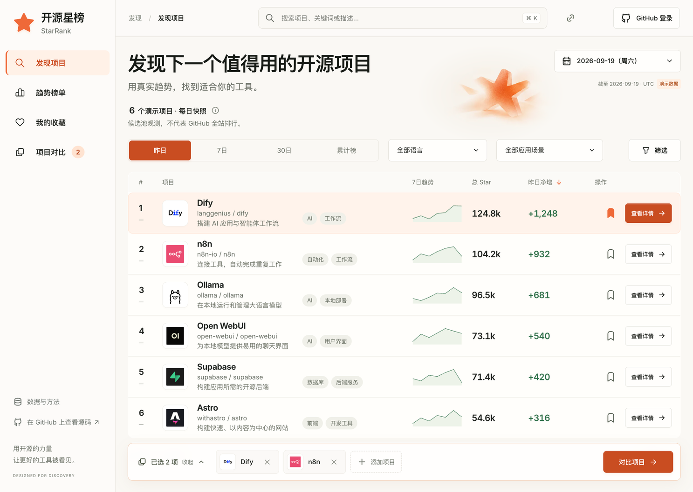
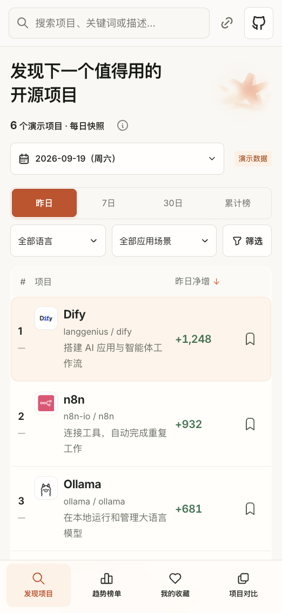

# 开源星榜 · 暖橙工作台 Demo

独立 React 原型，源码已纳入仓库。生产站点仍由根目录的 `site/` 构建。

保留图一的侧栏、搜索、筛选与榜单结构，融合图三的暖白底、橙色强调、圆角和柔和材质。选定融合稿保存在 `evidence/visual-target.png`。2026-09-19 根据 UI 审查完成了反馈、手机布局、对比流程和加载体积优化。

## 可以体验

- 搜索和组合语言、场景、最低 Star 筛选；按昨日、7日、30日净增或累计 Star 排序。
- 3 个固定日期快照；累计榜不再重复显示总量，零值、负值和缺失有不同含义。
- 本机收藏刷新保留；空收藏正确保存，浏览器存储不可用时回退为当前会话。
- URL 恢复筛选、日期、详情、趋势标签和对比选择；复制链接、浏览器前进后退、详情返回对比。
- 最多 3 项对比，满额提示与替换入口、相近场景提示、只看差异、能力/部署/许可/资源/活动/适用人群与官方来源。
- 手机底部导航、可折叠对比栏、较大文字和点击区域、固定的详情标题和操作区。
- 加载、失败重试、更新延迟、缺失/负增长/归档示例、空快照。可在“数据与方法 → 体验不同数据状态”切换。
- 可访问的每日图表数据表，键盘控制和减少动态效果偏好。

所有 Star 数、快照日期、最近活动、边界状态均为演示数据。能力和部署概览查阅了各项目官方仓库并显示查阅日期；资源条件未做基准测试，许可条件须到源仓库核验。真实版本通过官方 releases 链接查看，本页没有实时版本接口。

收藏仅在当前浏览器保存，不随分享链接传递；对比与筛选保存在 URL；演示账户仍是页面会话状态。默认不预选收藏或对比项目。没有真实认证、账号写入或后台 API。`127.0.0.1` 预览链接仅在本机有效。

## 设计与动效

- 纸白 `#faf8f4`、表面 `#fffefc`、装饰橙 `#ef6938`、正向趋势绿 `#34744d`；白字主按钮使用更深橙色。
- Inter Variable + 系统中文字体；[Tabler Icons](https://tabler.io/icons)；[Motion](https://motion.dev/docs/react-layout-animations) 导航、排序、抽屉和按压反馈。减少动态效果时关闭非必要位移和图表动画。
- 星形为原有 Image Gen 图片，使用 320/640px WebP 响应式版本。项目头像来自官方 GitHub 组织，来源记录在 `evidence/asset-sources.json`。
- 首屏微型趋势由 Canvas 绘制演示数值；展开的趋势图才加载 Recharts。图表不是装饰图片。

## 文件与验证

- `src/App.jsx`：页面组合和用户操作。
- `src/navigation.js`、`useNavigation.js`：URL、历史与收藏存储合同。
- `src/data.js`、`snapshot-service.js`、`useSnapshot.js`：演示快照、查询与取消请求。
- `src/ProjectPanels.jsx`、`insights.js`：详情、对比、筛选、数据说明和定性信息。
- `src/TrendChart.jsx`：按需加载的趋势图和可访问数据表。
- `src/ui.jsx`、`styles.css`：界面组件、反馈、响应式与动效回退。
- `tests/ui-state.test.mjs`：URL、持久化、取消、异常状态和数据一致性回归。
- `design-qa.md`：当前视觉与交互验收；`evidence/optimization-20260919/`：本轮证据。

从仓库根目录运行：

```sh
cd prototypes/starrank-ui
npm ci
npm run build
npm test
npm run dev -- --host 127.0.0.1 --port 4323 --strictPort
```

需要 Node.js 22.19+。首次运行先构建再测试，因为四项打包适配测试会检查生成产物。浏览器访问 `http://127.0.0.1:4323/`；端口占用时选择其他空闲端口。`npm run test:ui` 可独立运行状态与数据测试，`npm run test:sites` 检查保留的 Sites 打包适配。

首屏 JS 从约 732 KB 缩至约 374 KB（gzip 约 120 KB）；图表约 365 KB 分开加载。插画从 1,420,151 B PNG 改为 1,740 B / 5,150 B WebP，原图仍保留作为来源但页面不请求它。这里比较的是构建文件和资源字节数，并非真实网络性能评分。

这是已纳入仓库的独立 UI 原型，尚未迁移到 Astro 业务页面、未连接真实数据和 GitHub 登录、未部署。正式接入仍需组件迁移、实际接口、鉴权与服务端验收。浏览器响应式和键盘检查不等同于真实手机或完整屏幕阅读器认证。

## 预览




